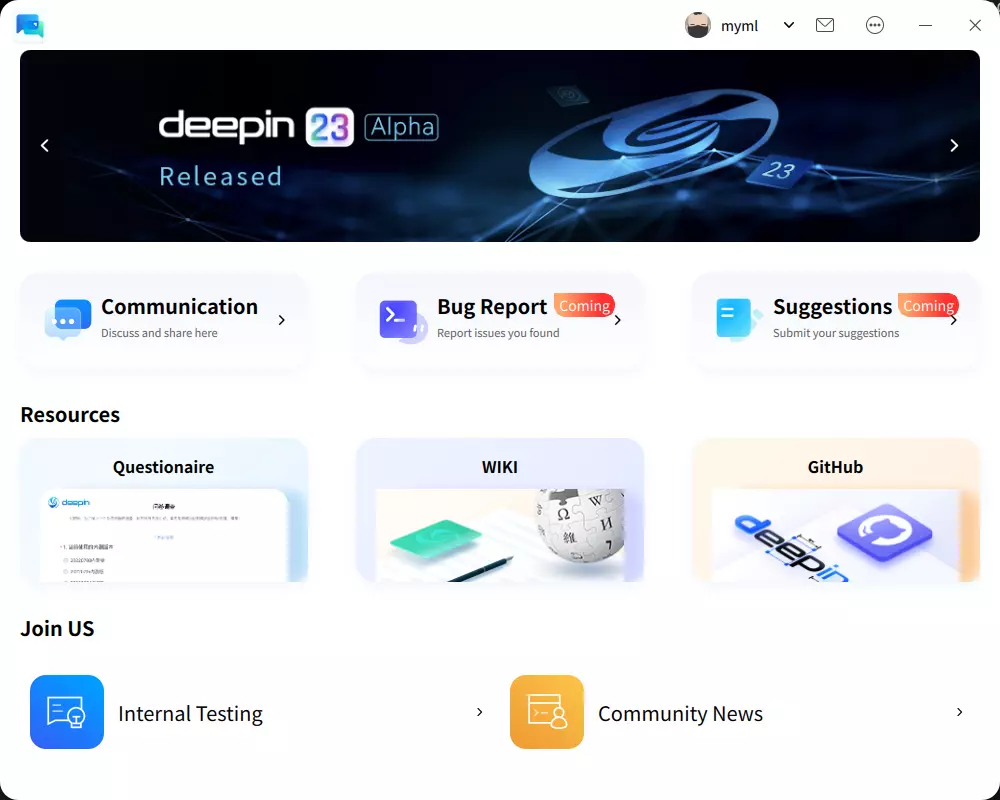

# deepin-home

- [x] Receive Community News & Questionnaire

- [x] Quick Login Forum (SSO)

- [x] Bug Report & Suggestions

- [ ] Forum Message Notification

[中文说明](README.zh_CN.md)

## Screenshot



## Dependencies

- build-essential:amd64

## Build dependencies

- build-essential:amd64
- debhelper
- cmake
- qt5-default
- qtbase5-dev
- qtdeclarative5-dev
- libdtkcommon-dev
- libdtkcore-dev
- libdtkgui-dev
- libdtkdeclarative-dev
- qttools5-dev-tools
- qml-module-qtquick-dialogs

## Build from source code

### Make sure you have installed all dependencies

```shell
sudo apt build-dep deepin-home
```

### Build

```shell
git clone https://github.com/linuxdeepin/deepin-home.git
cd deepin-home
mkdir build
cd build
cmake -DCMAKE_BUILD_TYPE=Debug ..
make -j
```

### Debug Run

```sh
# in the deepin-home/build/ directory
./src/main/deepin-home-daemon &
./src/main/deepin-home
```

### Install

```sh
# in the deepin-home/build/ directory
cmake -DCMAKE_BUILD_TYPE=Release ..
make -j && sudo make install
```

### Build DEB Package

```sh
# in the deepin-home/ directory
dpkg-buildpackage -us -uc
```

## Getting help

- [Official Forum](https://bbs.deepin.org/)
- [Developer Center](https://github.com/linuxdeepin/developer-center)
- [Matrix](https://matrix.to/#/#deepin:matrix.org)
- [Wiki](https://wiki.deepin.org/)

## Getting involved

We encourage you to report issues and contribute changes

- [Contribution guide for developers](https://github.com/linuxdeepin/developer-center/wiki/Contribution-Guidelines-for-Developers-en)

## License

deepin-home is licensed under [LGPL-3.0-or-later](LICENSE).
