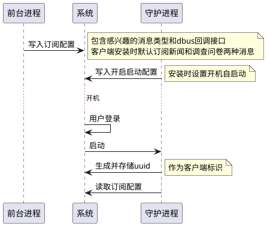
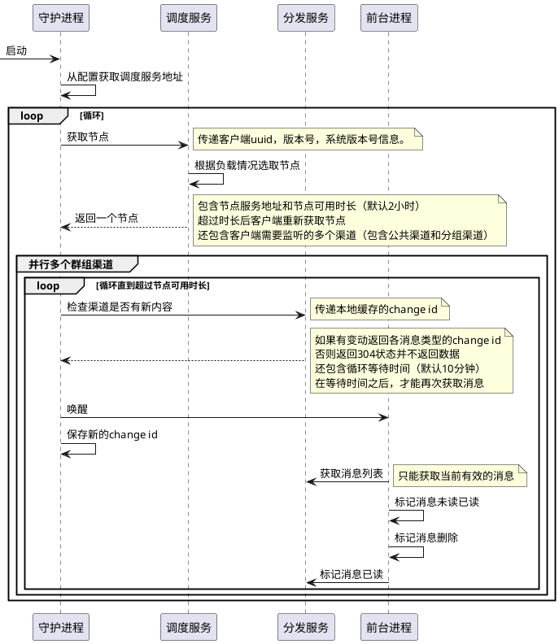
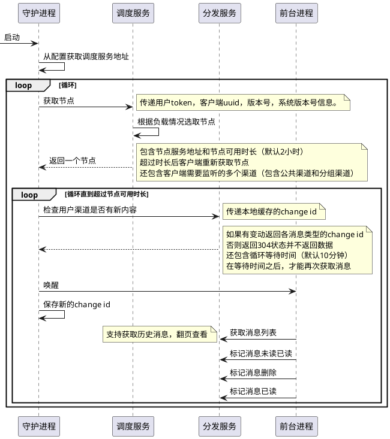

# deepin社区应用

*请使用支持 plantuml 渲染的 markdown 阅读器* [vscode plugin](https://marketplace.visualstudio.com/items?itemName=myml.vscode-markdown-plantuml-preview)

## 总体架构

<!-- 短连接通信，https拉取消息，无低延迟需求 -->

```plantuml
(调度服务)
(管理服务)
(登录服务)
(后台管理界面)
database 数据库

cloud 分发服务 {
    node 分发节点1
    node 分发节点2
}
(客户端1)
(客户端2)
(客户端3)
(客户端4)
后台管理界面 -r-> 管理服务
管理服务 --> 数据库: 写入消息
调度服务 --> 数据库: 获取节点列表
调度服务 --> 分发服务: 调度节点
登录服务 --> 数据库: 写入用户信息 
分发节点1 -u-> 数据库: 读取消息
分发节点2 -u-> 数据库: 读取消息
客户端1 -u-> 分发节点1
客户端2 -u-> 分发节点1
客户端3 -u-> 分发节点2
客户端4 -u-> 分发节点2
```

客户端在连接分发节点之前，从调度服务获取分发节点的地址，调度服务选取负载较低的分发节点返回给客户端。

调度服务在把节点返回给客户端的时候，刷新了节点的负载。

## 消息分类

```plantuml
frame 消息渠道 {
    (用户消息)
    (公共消息)
    (群组消息)
}
frame 消息类型 {
    (论坛私信)
    (用户反馈)
    (新闻)
    (调查问卷)
    (内测渠道)
    (活动通知)
}
用户消息 --> (论坛私信)
用户消息 --> (用户反馈)
公共消息 --> (新闻)
公共消息 --> (调查问卷)
群组消息 --> (活动通知)
群组消息 --> (内测渠道)
群组消息 --> (新闻)
群组消息 --> (调查问卷)
```

消息分为公共消息、群组消息和用户消息：

公共渠道是默认订阅的，使用uuid做唯一标识，因为范围太广，刷新频率会设置的比较低，数据可加CDN缓存。

群组渠道为管理员手动为客户端分组，便于组播消息，和公共渠道一样使用uuid做维一标识。公共渠道算是特殊的群组渠道。

用户渠道仅在用户登录后订阅，使用用户ID做唯一标识，范围较小，刷新频率相对会设置的高一些，数据不缓存。

## 消息状态机

```plantuml
frame 消息状态 {
    (未分发)
    (未读)
    (已读)
    (已删除)
}
未分发 --> 未读
未读 -> 已读
已读 -u-> 已删除
```

状态解释：

未分发：客户端还未接收，消息标记为”未分发“

未读：消息已被客户端接收，但用户还未阅读

已读：消息已被用户阅读

已删除：消息已被用户删除

*仅用户消息由服务端存储状态，群组消息和公共消息仅在客户端存储状态*

## 客户端状态机

```plantuml
frame 用户消息状态 {
    (在线)
    (离线)
}
在线 <==> 离线: 30分钟内无连接，标记离线

```

## 客户端工作工作流程

客户端分为前台进程和守护进程两个二进制程序，daemon负责从服务器监听消息变动，在消息变动后唤醒客户端。

### 消息订阅

消息订阅设计成可配置可扩展的，便于其他应用也可接入



客户端在安装时会设置开机自启，并添加两个消息类型的订阅

### 公共消息和群组消息通知



节点的刷新时间和消息的刷新时间都由服务端控制，可以根据负载情况动态调节。

守护进程仅获取消息是否有更新，然后唤醒订阅的进程，自身并不获取消息内容。

公共消息不记录客户端的消息状态，仅在消息阅读后，记录已读以用于分析。

### 用户登录

```plantuml
用户 -> 客户端: 点击登录
客户端 -> 登录服务: 获取oauth2信息
客户端 -> deepinid: 传递oauth2信息
deepinid -> 用户: 显示登录界面
用户 -> deepinid: 输入账户密码登录
deepinid --> 客户端: 返回code
客户端 -> 登录服务: 使用code获取token
登录服务 -> deepinid服务: 检查code
登录服务 -> deepinid服务: 获取用户信息
客户端 <-- 登录服务: 返回token
客户端 -> 登录服务: 使用token获取用户信息
```

### 用户消息订阅



和公共渠道的区别主要在于所有接口都需要传递用户ID，以识别用户信息，消息的状态由服务器保存，可以在多个机器之间同步。

### 单点登录

```plantuml
用户 -> 客户端: 点击互动交流
客户端 -> 登录服务: 获取论坛登录token，10s过期
客户端 -> 论坛: 在浏览器打开论坛，附带论坛登录token
论坛 -> 客户端: 识别token，确定登录状态
```

token使用jwt格式，有非对称签名保证防篡改，防伪造。

token过期时间应该尽可能短，避免在浏览器历史记录里泄露。

## 服务端工作流程

### 公共消息和群组消息创建

```plantuml
管理员 -> 管理服务: 创建消息
管理服务 -> 数据库: 写入消息内容
管理服务 -> redis: 刷新消息类型的change ID
管理服务 -> redis: 刷新消息渠道的change ID
```

change ID 用于表示消息的最后修改，通过对比change id判断渠道是否有新的消息。

### 用户消息创建

```plantuml
论坛 -> 管理服务: 创建用户消息
管理服务 -> 数据库: 写入消息
管理服务 -> redis: 刷新消息类型ID
```

## 关键API接口

GET /api/public/machine/:machine_id/node

获取有效节点和可用渠道列表

GET /api/public/channel/:channel_id/topics

获取某个渠道的消息类型列表

GET /api/public/channel/:channel_id/topic/:topic_id/messages

获取某个类型的消息列表

GET /api/public/message/:id

获取单个消息的详细信息

PUT /api/public/message/:id/status

标记已读消息

GET /api/user/login

获取登录所需配置

POST /api/user/login

获取登录凭证

/api/user/topics

获取用户消息类型列表

/api/user/topic/:topic_id/message

获取某个类型的消息列表

GET /api/user/message/:id

获取用户消息的详细信息

PUT /api/public/message/:id/status

标记消息状态(已读、未读)

DELETE /api/public/message/:id/status

删除消息

POST /api/admin/news
